### **Étape 1 : Initialisation de l’environnement et installation de MLflow**
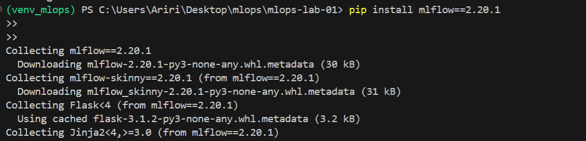
### **Étape 2 : Création explicite de l’espace de stockage MLflow**
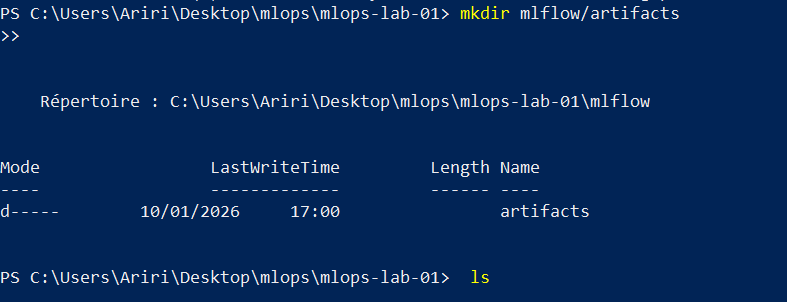
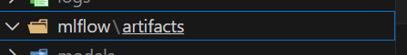
### **Étape 3 : Configuration du client MLflow**
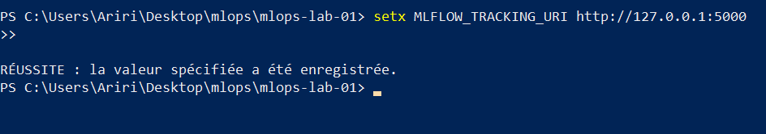
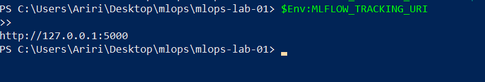
### **Étape 4 : Démarrage du serveur MLflow (tracking server)**
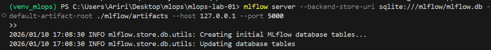
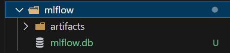
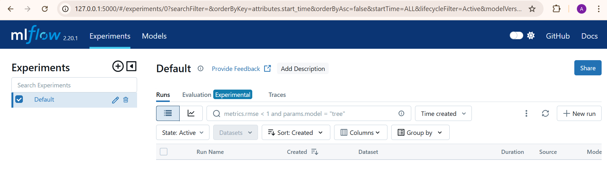
### **Étape 5 : Instrumentation réelle de train.py**
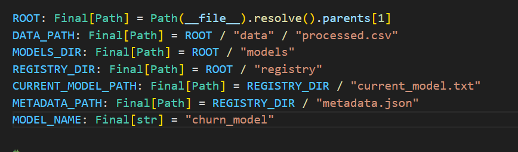
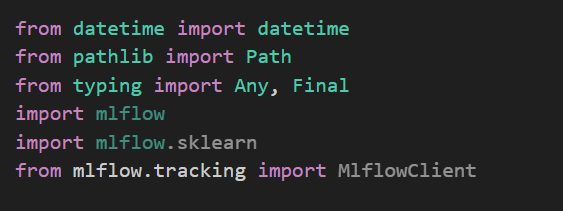
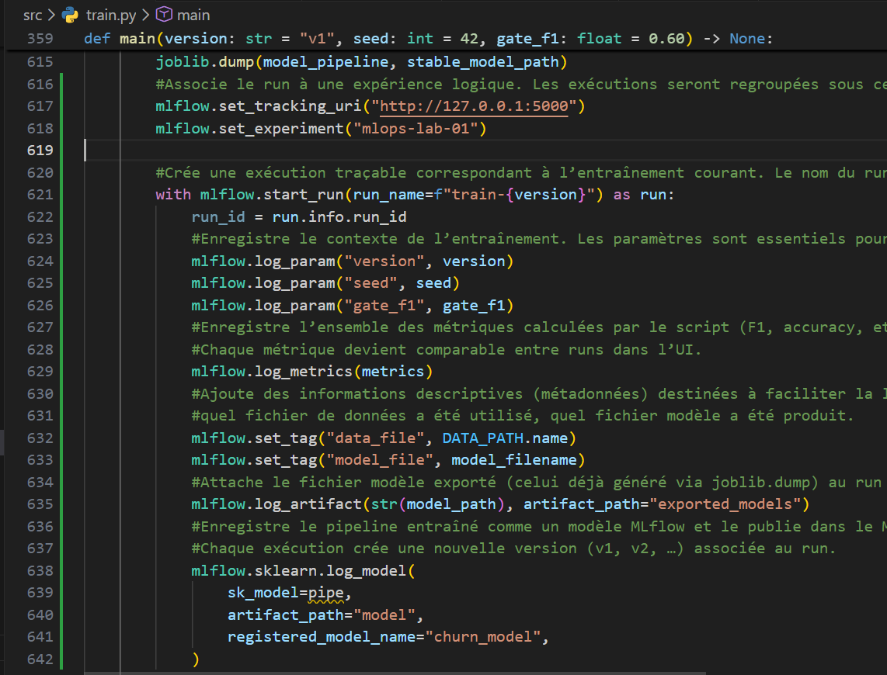
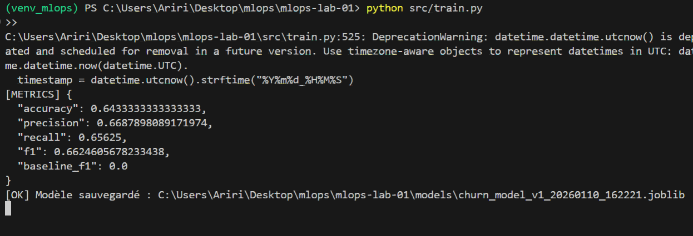
### **Étape 6 : Observation du registry MLflow**
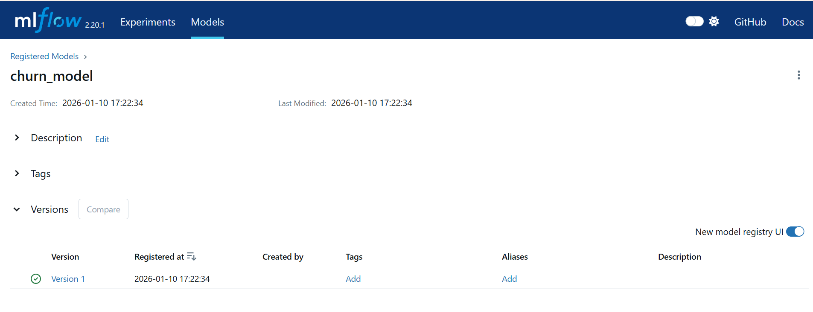
### **Étape 7 : Promotion d’un modèle (activation)**
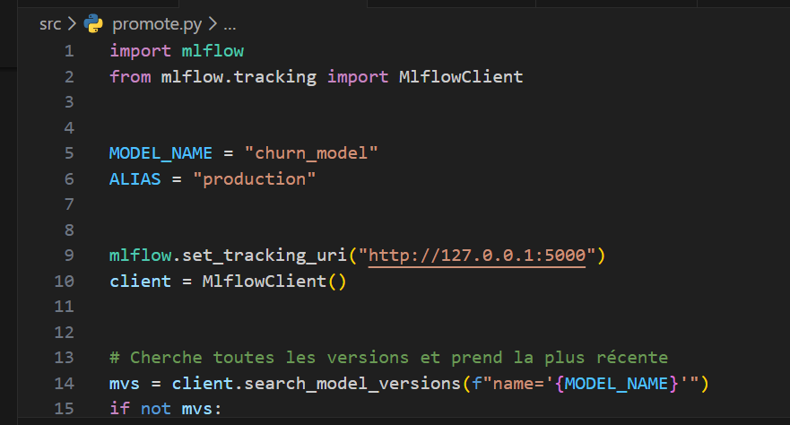
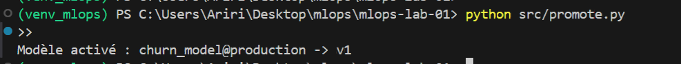
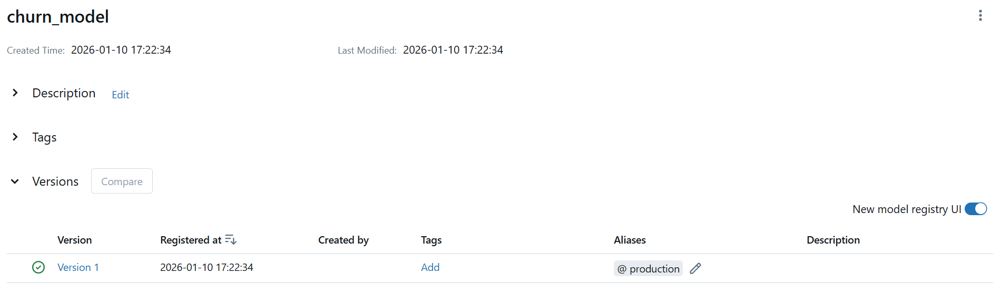
### **Étape 8 : Rollback via MLflow Model Registry**
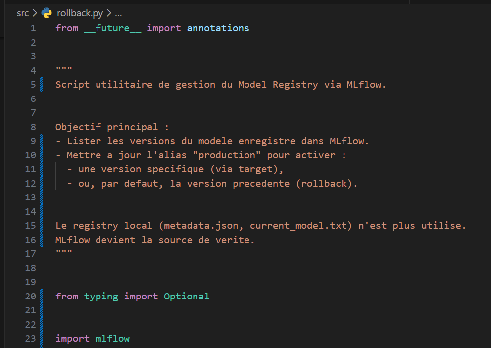
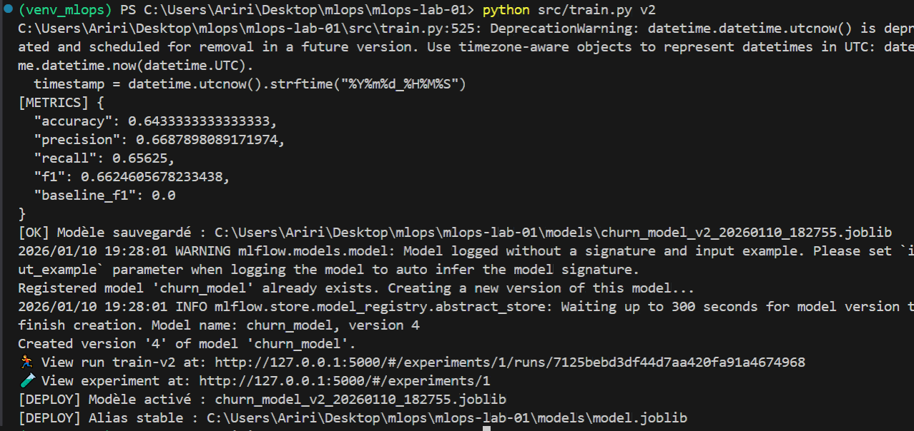
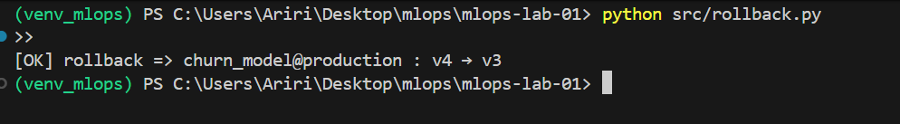
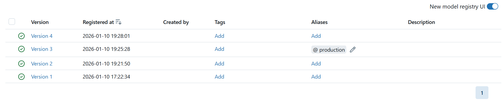
### **Étape 9 : API : chargement du modèle actif**
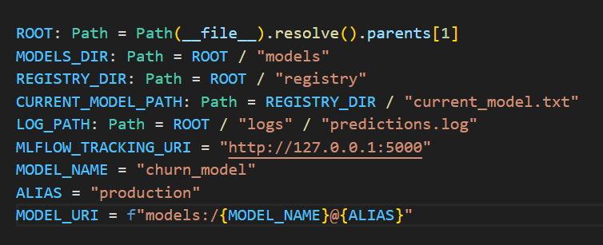
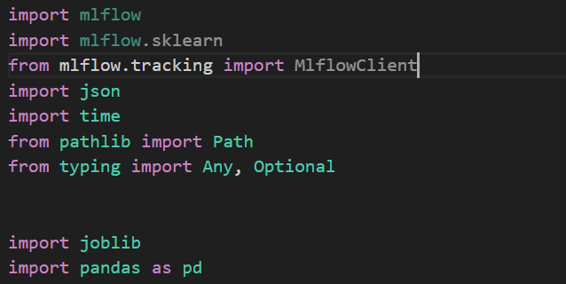
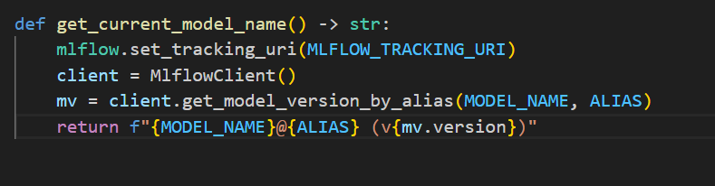
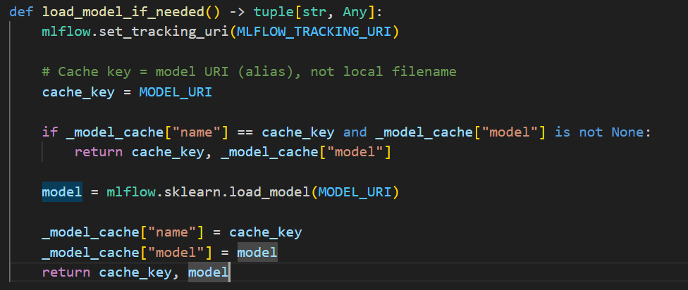
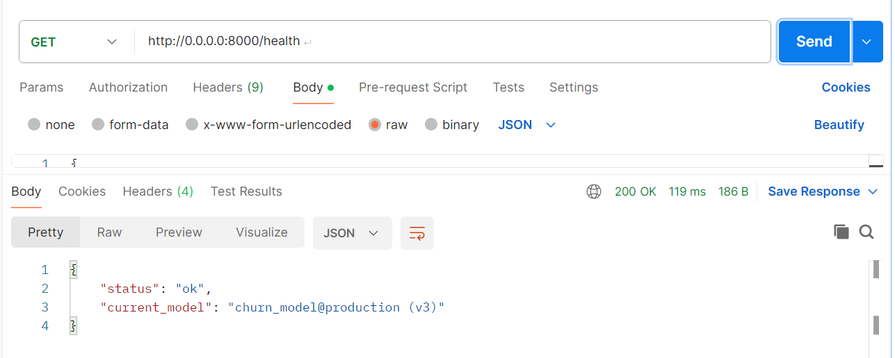
